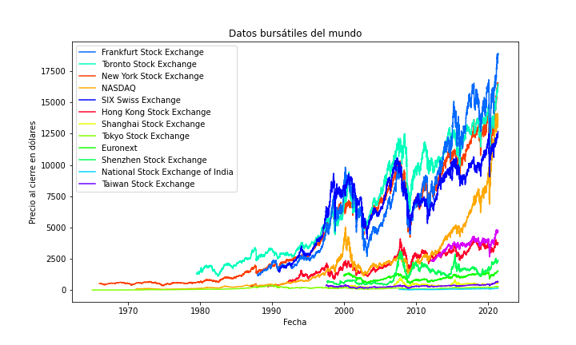

# ProyectoAnalisisEDA-DatosBursatilesMundiales
Proyecto intermedio con análisis EDA de la clase de Desarrollo de Proyectos de la Maestría en Ciencia de los Datos (MCD) de la Universidad de Guadalajara (UDG) en el Centro Universitario de Ciencias Económico Administrativas (CUCEA).

El Jupyter Notebook se encuentra en este [enlace](/src/EDA-DatosBursatilesMundiales.ipynb).

Una de las gráficas que se generaron es la siguiente:

